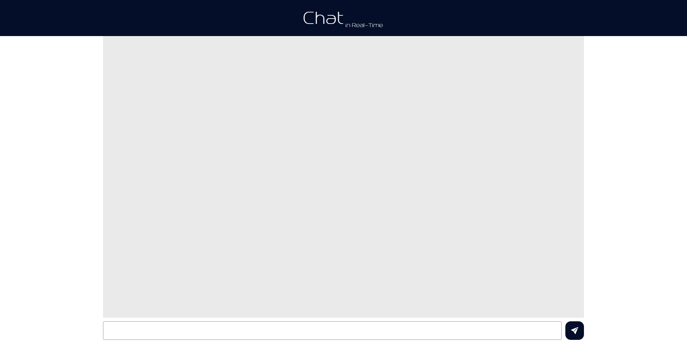

# Project image - Chat in Real-Time

# View ipconfig
  1. Go to CMD on your machine and type "ipconfig"
  2. Search for "IPv4 Address" and copy your IP
  3. Go to the "server.js" file and change the IP value on line 21 to what you copied

# Start project
  Run: <strong>npm start</strong> or <strong>nodemon server.js</strong>

Ready! 👍
